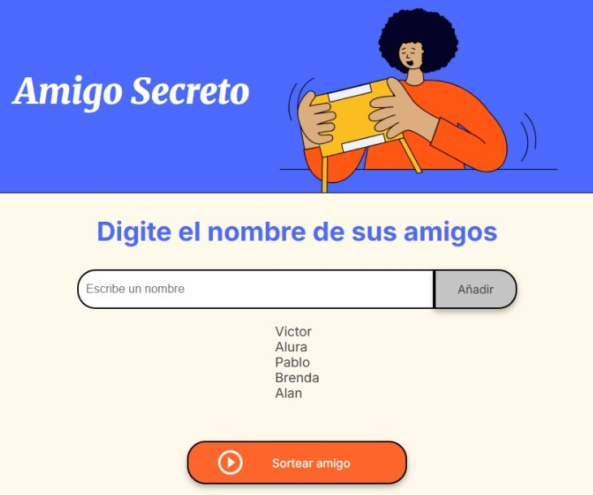

# Challenge Amigo secreto alura

## Objetivo
Este challenge consistió en desarrollar una aplicación para el sorteo de un "Amigo Secreto", aplicando conceptos clave de programación para gestionar participantes y asignaciones de manera aleatoria.
## Aprendizaje
Durante el desarrollo del challenge, pude reforzar aún más los conocimientos que adquirí en los cursos y que ya tenía con anterioridad. Algunos de estos conocimientos que se vieron reflejados fueron bucles, arrays, condicionales, inputs, outputs y el uso de métodos concretos de JavaScript.

## Manual
- Su forma de uso es agregar un elemento a el input, en este caso un nombre.

- Al pulsar "Añadir", se agregara el nombre a la lista de amigos

- No se pueden ingresar el campo vacio, de ser asi se mostrara la siguiente alerta.

- No se pueden ingresar solo numeros, de ser asi se mostrara la siguiente alerta.

- Si se pulsa "Sortear amigo" y solo hay un elementos en la lista de amigos, se mostrara la siguiente alerta.

- Si se pulsa "Sortear amigo" y hay varios elemntos en las lista, al azar se mostrara un nombre de un amigo.

